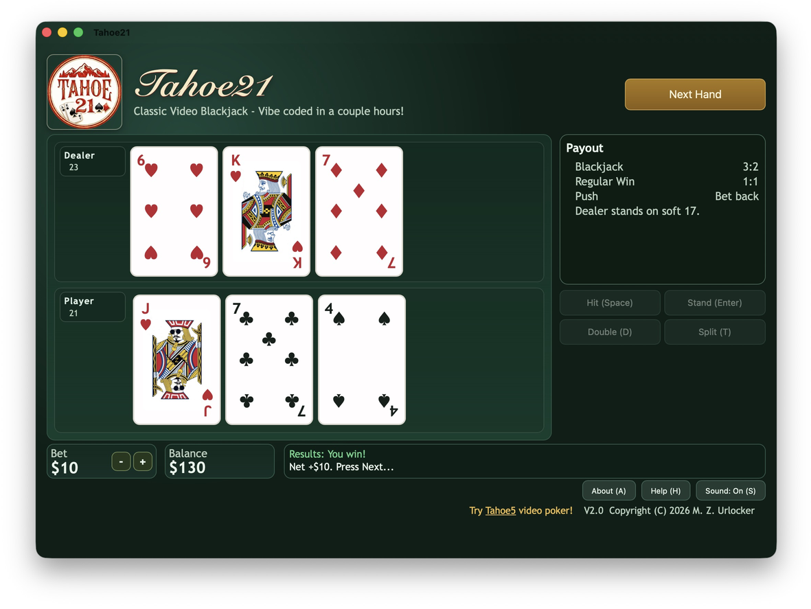

# Tahoe21

Tahoe21 is a browser-based video blackjack game. It reuses the layout, card artwork and sound design
of [Tahoe5](https://github.com/ZUrlocker1/Tahoe5), the video poker game it was scaffolded from.



## Play It

**In a browser** — [zurlocker1.github.io/Tahoe21](https://zurlocker1.github.io/Tahoe21/). Nothing to
install, and it works on desktop and mobile.

**On a Mac** — [download Tahoe21.dmg](https://github.com/ZUrlocker1/Tahoe21/releases/latest/download/Tahoe21.dmg).
A native Mac app: the same game running in a WebKit view, so it gets a real window, a Dock icon, and
works offline. Requires macOS 14 or later. Signed and notarized, so it opens without Gatekeeper
complaining. Source is in [`mac/`](mac/).

**On iPhone and iPad** — a native version was built and works, but it is not distributed. Apple does
not allow individual developers to publish apps whose rating declares simulated gambling; that
requires enrolling as an organization, which means forming a legal entity. Not worth it for a hobby
game, so the browser version is how to play on iOS.

## Project Background

This one has no 1992 original behind it. It was built by writing a PRD with Codex and VS Code, and
re-using the overall layout and style of the Tahoe5 poker game. I added Double and Split even though
I did not know how they worked — ChatGPT explained the rules in the PRD.

The first working prototype took about fifteen minutes, then a couple of hours adjusting the game
play and layout.

## What This Repo Contains

- A playable web blackjack app in `/app`
- Product requirements document in `PRD.md`
- The native Mac / iPhone / iPad app in [`/mac`](mac/) — an Xcode project that wraps the game in a
  WebKit view. See [`mac/README.md`](mac/README.md) for how it is built and released.

**`/app` and `/mac/Web` are two different versions of the game.** `/mac/Web` began as a copy of
`/app` and then diverged: About panel wording, a cross-promotion link, and a lot of responsive CSS
for iPad sizes and small Mac windows. This was a one-way conversion — the two are deliberately not
kept in sync, and neither is being updated. `/app` is what GitHub Pages serves; `/mac/Web` is what
ships inside the Mac app.

## Features

- Blackjack against a dealer who stands on soft 17
- Hit, Stand, Double and Split
- Blackjack pays 3:2, regular win 1:1, push returns the bet
- Keyboard controls: Space to hit, Enter to stand, `D` double, `T` split, `Esc` reset
- Audio cues for deal, wins, losses and blackjack
- Custom card graphics with themed backs and face-card artwork

## Run Locally

```bash
cd app
python3 -m http.server 8080
```

Then open `http://localhost:8080`.
